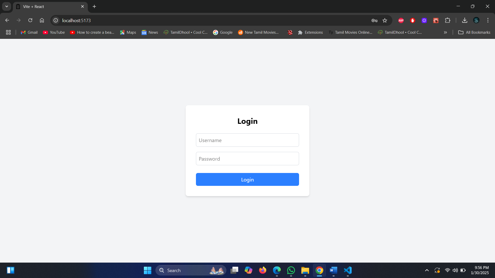
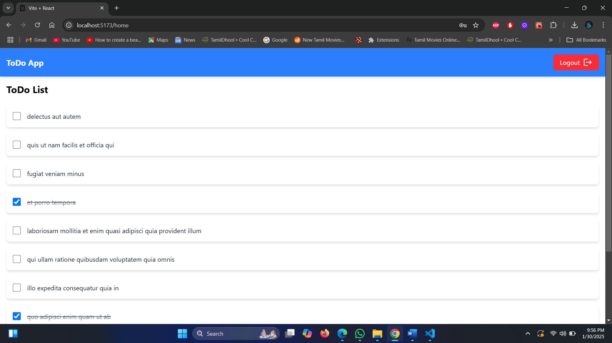
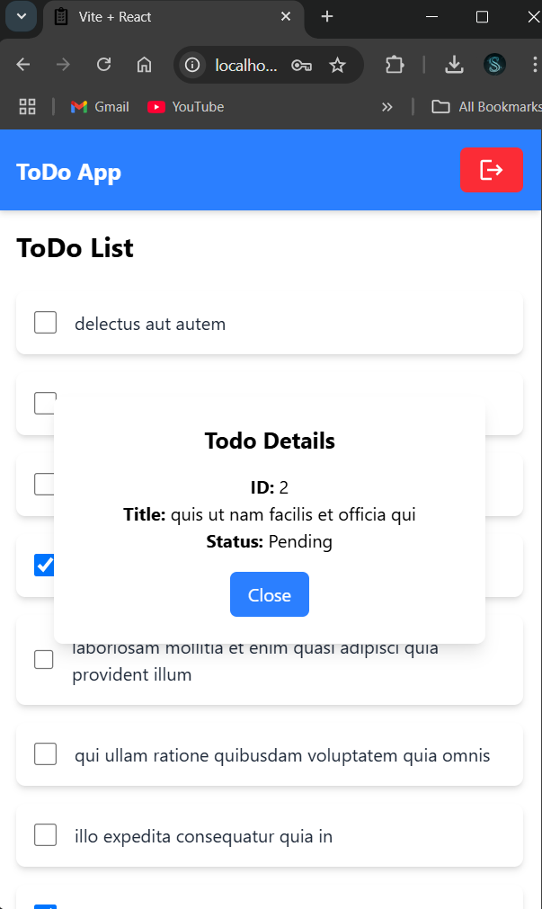
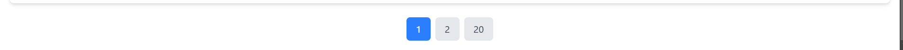

# React Todo App with Authentication and Pagination

This is a user-friendly web UI developed using **React**, **Vite**, **Tailwind CSS**, **React Hot Toast**, and other necessary third-party libraries. The app features a login screen, a ToDo screen with dynamic fetching and pagination, and a logout functionality.

## Table of Contents
- [Project Overview](#project-overview)
- [Features](#features)
  - [1. Login Screen](#1-login-screen)
  - [2. Header Design](#2-header-design)
  - [3. ToDo Screen](#3-todo-screen)
  - [4. Logout Functionality](#4-logout-functionality)
- [Technologies Used](#technologies-used)
- [Screenshots](#screenshots)
- [Installation](#installation)
- [Usage](#usage)
- [License](#license)

## Project Overview

This project is a web application designed to manage ToDos. It allows users to log in with predefined credentials, view a list of todos, view the details of each todo, and log out. The app features pagination and provides a popup to view more details about a todo item.

## Features

### 1. Login Screen:
- Implemented a login interface with fields for username and password.
- Predefined credentials:  
  **Username**: `admin`  
  **Password**: `admin`
- Displays an error message if the incorrect username/password combination is entered.

### 2. Header Design:
- Created a header with the following menu options:
  - **ToDo**
  - **Logout**

### 3. ToDo Screen:
- After a successful login, users are directed to the ToDo screen.
- The ToDo list is fetched from the following API:  
  `https://jsonplaceholder.typicode.com/todos`
- The todos are displayed in a table format with pagination for better navigation.
- Clicking on a todo item displays its details in a popup, fetched dynamically from:  
  `https://jsonplaceholder.typicode.com/todos/<id>`, where `<id>` corresponds to the clicked item.

### 4. Logout Functionality:
- A **Logout** option is provided in the header menu.
- When clicked, it redirects users to the **Login** screen.

## Technologies Used

- **React** for building UI components.
- **Vite** for fast bundling and development.
- **Tailwind CSS** for styling.
- **React Hot Toast** for user notifications.
- **Axios** for making API calls.
- **React Router** for navigation.
- **@mui/icons-material** for Logout Icon

## Screenshots

Below are the screenshots of the app's output:
dynamicScreen
### Login Screen:


### ToDo Screen:


### Todo Details Dynamic and popup:


### pagination Design:


## Installation

To install and run the project locally, follow these steps:

1. Clone the repository:
   ```bash
   git clone https://github.com/sanjeevantech/todo-app.git
